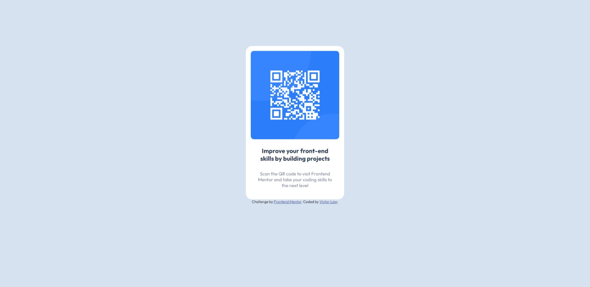

# Frontend Mentor - QR code component solution

This is a solution to the [QR code component challenge on Frontend Mentor](https://www.frontendmentor.io/challenges/qr-code-component-iux_sIO_H). Frontend Mentor challenges help you improve your coding skills by building realistic projects.

## Table of contents

- [Overview](#overview)
  - [Screenshot](#screenshot)
  - [Links](#links)
- [My process](#my-process)
  - [Built with](#built-with)
  - [What I learned](#what-i-learned)
- [Author](#author)

## Overview

### Screenshot

### Links

- Solution URL: [https://www.frontendmentor.io/solutions/qr-code-NwyO4WrmLz](https://www.frontendmentor.io/solutions/qr-code-NwyO4WrmLz)
- Live Site URL: [https://manhon95.github.io/qr-code-component-main/](https://manhon95.github.io/qr-code-component-main/)

## My process

- Putting the elements in HTML file
- Adjust the element positions by flexbox and padding
- Adjust the font and font-size
- Apply the color styles

### Built with

- Flexbox!

### What I learned

- Using display-flex for centering!
- Having Landmarks in the website!

## Author

- Frontend Mentor - [@manhon95](https://www.frontendmentor.io/profile/manhon95)
